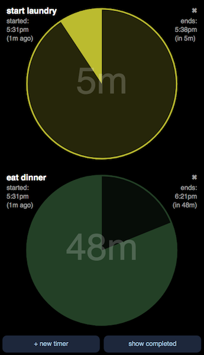

# Bun Timer 🐰 ⌛

A gentle timer app to remind you to do things

This is a work-in-progess



Design goals:

* Silent, gentle, low stress
* Minimally distracting, almost no animations
* When a timer goes off it’s not treated as an emergency that interrupts you. Instead it turns red and just sits there silently until you manually dismiss it. This helps you remember if you’ve done the thing or not.
* Easy to understand at a glance - leave it open in the corner of your screen
* You can see a history of your timers for the day

## Demo versions

If you want privacy, use this version which only stores data in your browser:
https://buntimer2020.netlify.com/?yourname

If you want it to sync, use this version which stores data in Firebase (not encrypted or anything)
https://buntimer2020.firebaseapp.com/?yourname

There’s no account system. Just change `yourname` above to a long string that nobody will guess.

## Security

The firebase database security rules have not been set up yet, so it's possible for anyone to read all the data.

## Install

```
npm install
npm run build
npm run serve
```
Now you can test it locally at http://localhost:8003

The same codebase runs in two modes: localStorage (store data in the browser) and Firebase (store data in the cloud).  It detects which version of the code to use based on the URL it's running on.  See the end of `src/app.tsx`.

## Deploy as a static site with in-browser storage

First build and commit the compressed version of the javascript:

```
npm run build-prod
git add -A
git commit 'built for prod'
git push
```

Set up hosting on https://netlify.com or another static hosting site.  Netlify can be set up to auto-deploy when you push commits to github.

## Deploy on Firebase

On Firebase, set up a Firestore database and static hosting.

```
npm run build-prod
firebase serve    # run local version for testing, that connects to the cloud database
firebase deploy   # upload static files to firebase hosting
```

You'll need to update the Firebase config values in `src/config.ts`.

## TODO

Firebase version:
* database security rules
* authentication
* login screen

click duration to change it

add an icon to bring up action button overlay

change actions in button overlay
    snooze
    delete
    done
    do & repeat

create timers using natural language text entry in a field at the top

parse times relative to current time, not locked to same calendar day

optional sounds
